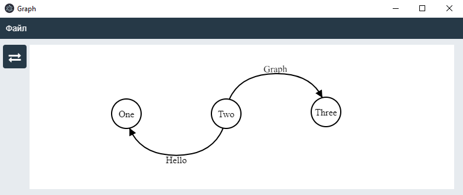

# Graph Web

## Description

A program to draw graphs on React and Electron.



At this moment there is implemented next opportunities:
- Add, remove, move nodes
- Add, remove, move, curve edges
- Edit node and edge text
- Switch on/off direction of the graph
- Save, load the graph

## Installation

```bash
# Clone repository or just download zip.
git clone https://github.com/darkjedi9922/graph-web.git

# Go to the project directory.
cd graph-web

# Install dependecies with npm.
npm install

# Build assets.
npm run webpack

# Build Electron for Windows.
npm run build-win32
# Or build for Linux.
npm run build-linux

# The built program will be in the "build" directory.
```

## License

MIT License. Copyright (c) 2019 Jed Dark